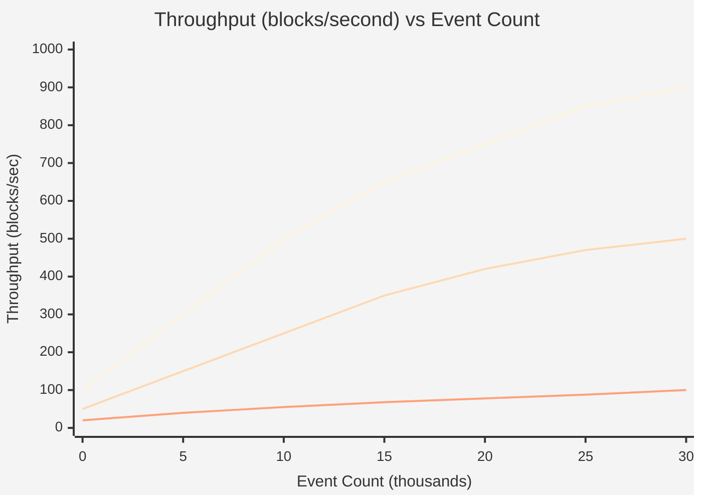
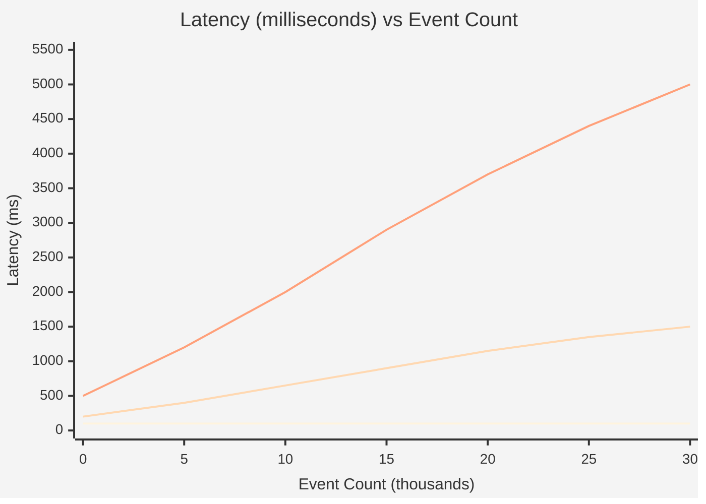
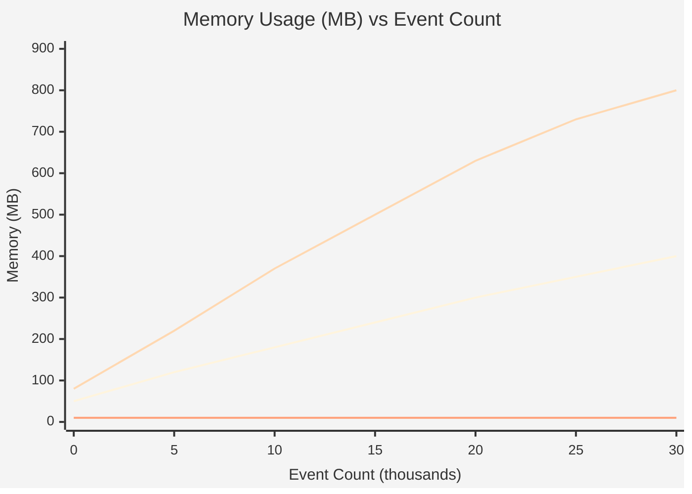

# COMPARISON CHART

## Performance Metrics vs Operational Scale

### Chart 1: Throughput (blocks/second)

### Chart 2: Latency (milliseconds)

### Chart 3: Memory Usage (MB)

## Strategy Characteristics

| Strategy | Throughput @ 30K | Latency @ 30K | Memory @ 30K | Best For |
|:---------|:----------------|:--------------|:-------------|:---------|
| **Batch + Cache** | 900 blocks/sec | 100ms (constant) | 400MB (sublinear) | Historical analytics, reporting |
| **Real-time Stream** | 500 blocks/sec | 1500ms (linear) | 800MB (linear) | Live dashboards, monitoring |
| **On-chain Query** | 100 ops/sec | 5000ms (superlinear) | Minimal (on-chain only) | User-initiated claims, infrequent queries |
